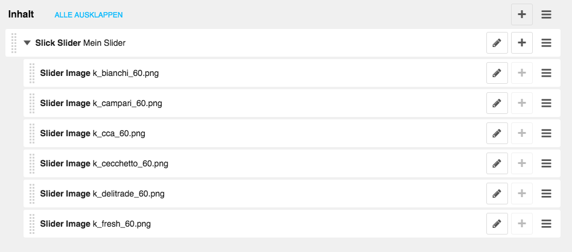
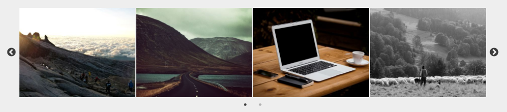

==============================
Django CMS Slick Slider Plugin
==============================

.. image:: https://badge.fury.io/py/djangocms-slick-slider.svg
    :target: https://badge.fury.io/py/djangocms-slick-slider

.. image:: https://travis-ci.org/oesah/djangocms-slick-slider.svg?branch=master
    :target: https://travis-ci.org/oesah/djangocms-slick-slider

.. image:: https://codecov.io/gh/oesah/djangocms_slick_slider/branch/master/graph/badge.svg
    :target: https://codecov.io/gh/oesah/djangocms_slick_slider

A Django CMS Slider Plugin with `Slick Slider <http://kenwheeler.github.io/slick/>`_.

Features
--------

* Add a Slick Slider to any page via Django CMS Plugin
* Change/set Slick options via ``JSONField``
* Set some styling options such as color

**CMS**

**Admin Form**

.. image:: docs/media/admin_form.png
   :alt: alternate text
   :align: right

**Output**

Documentation
-------------

The full documentation is at https://djangocms-slick-slider.readthedocs.io.

Quickstart
----------

Install djangocms_slick_slider::

    pip install djangocms-slick-slider

Add it to your `INSTALLED_APPS`:

.. code-block:: python

    INSTALLED_APPS = (
        ...
        'djangocms_slick_slider.apps.DjangocmsSlickSliderConfig',
        ...
    )

Example project
---------------

You can quickly get an example project up to test / develop the plugin.

If you have virtualenvwrapper installed::

    git clone https://github.com/oesah/djangocms_slick_slider.git
    cd example
    mkvirtualenv my_project_env
    pip install -r requirements.txt
    python manage.py runserver

Visit your homepage (usually http://localhost:8000).

User: :code:`admin`
Password: :code:`adminadmin`

You should see some instances of the ``Slick Slider`` plugin. You can play around
to see, how it works.

Settings
--------

SLICK_SLIDER_VERSION
^^^^^^^^^^^^^^^^^^^^

Version of Slick Slider that should be used. Keep in mind, that this version
needs to be in ``static/vendor/`` folder with the appropriate folder name.

If you want to upgrade, download and copy the new version into the before
mentioned folder and change the version in the settings.

default: ``1.8.0``

SLICK_SLICKER_DEFAULT_OPTIONS
^^^^^^^^^^^^^^^^^^^^^^^^^^^^^

ToDo

SLICK_SLIDER_ACE_THEME
^^^^^^^^^^^^^^^^^^^^^^

ToDo

SLICK_SLIDER_ACE_MODE
^^^^^^^^^^^^^^^^^^^^^

ToDo

Running Tests
-------------

Does the code actually work?

::

    source <YOURVIRTUALENV>/bin/activate
    (myenv) $ pip install tox
    (myenv) $ tox

If you have issues with different python versions, please take a look at
these docs: https://www.holger-peters.de/using-pyenv-and-tox.html

Release to PyPi
---------------

For versioning, you need to have `standard-version` installed::

    yarn install

Once you are ready and everything has been commited to git, you can run::

    yarn run release

This will:

* Bump the version in the according files
* Commit everything to git and create a git tag
* Create a package for PyPi and upload it
* Push everything to Git including tags

Credits
-------

Tools used in rendering this package:

*  Cookiecutter_
*  `cookiecutter-djangopackage`_
*  `Slick Slider`_

.. _Cookiecutter: https://github.com/audreyr/cookiecutter
.. _`cookiecutter-djangopackage`: https://github.com/pydanny/cookiecutter-djangopackage
.. _`Slick Slider`: http://kenwheeler.github.io/slick/

ToDos
-----

* make slider respect the order of ``SlickSliderImage`` Plugins
* add more styling options to plugin
* translations

